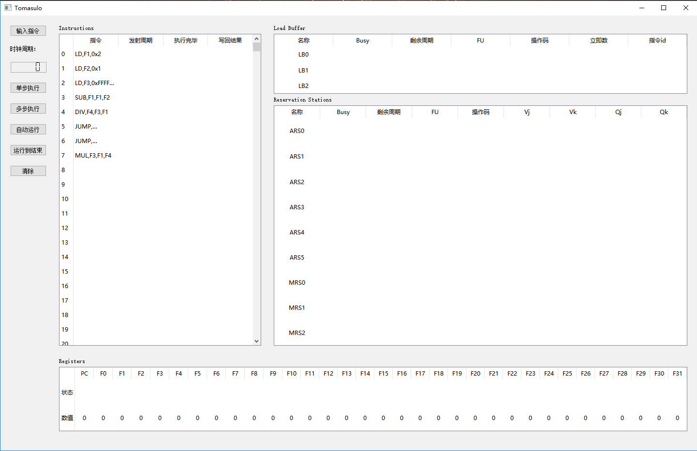
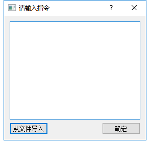
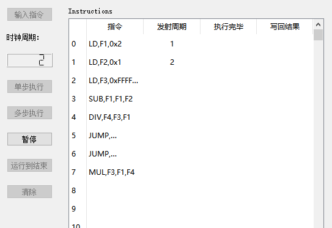
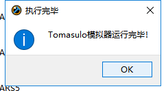
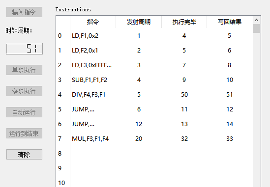

# Tomasulo模拟器 实验报告
---
## 设计思路
- 概述
    - 按照要求设计了流水线，实现了3个加减法器，2个乘除法器，2个Load部件
    - 实现了6个加减法保留站，3个乘除法保留站，3个Load Buffer
    - 实现了32个浮点数寄存器，分别为F0到F31
- 硬件
    - 见codes/tomasulo/hardware.py
    - 实现基类HardWare，子类Adder、Multer、Loader，以及实例化规定数量的部件
- 保留站和Load Buffer
    - 见codes/tomasulo/reservationstation.py
    - 实现保留站基类RS，Load Buffer基类LoadBuffer，并实现ReservationStation类整合它们
- 流水线
    - 见codes/tomasulo/tomasulo.py
    - 实现类Tomasulo，其中：
        - `Tomasulo.step(n)`方法模拟流水线经过n个时间周期的过程，n默认为1
            ```python
            while n > 0: #n个时间周期
                self.clock += 1

                #WRITEBACK
                for LB in self.RS.LB.values():
                    ... #写回Load Buffer中运行结束的指令结果

                for ARS in self.RS.ARS.values():
                    ... #写回加减法保留站中运行结束的指令结果

                for MRS in self.RS.MRS.values():
                    ... #写回乘除法保留站中运行结束的指令结果

                #EXCUTE
                for LB in self.RS.LB.values():
                    if LB.busy is True and LB.remain is not None:
                        LB.remain -= 1 #剩余周期-1
                        if LB.remain == 0: #当剩余周期为0，记录指令执行完毕的时间
                            if self.inst[LB.inst].ExecComp is None and self.inst[LB.inst].rs == LB.name:
                                self.inst[LB.inst].ExecComp = self.clock
                            Load[LB.FU].free() #释放Load部件资源

                for ARS in self.RS.ARS.values():
                    ... #同理

                for MRS in self.RS.MRS.values():
                    ... #同理

                #ISSUE
                if self.PC.status is None and self.PC.value < len(self.inst): #有指令需要发射
                    inst = self.inst[self.PC.value]
                    res = self.RS.busy(inst)
                    if res is not None:
                        if inst.Issue is None:
                            inst.Issue = self.clock #记录指令发射时间和发射指令的保留站名
                            if inst.op == Config.OP_LD:
                                inst.rs = self.RS.LB[res].name
                            elif inst.op == Config.OP_ADD or inst.op == Config.OP_SUB or inst.op == Config.OP_JUMP:
                                inst.rs = self.RS.ARS[res].name
                            elif inst.op == Config.OP_MUL or inst.op == Config.OP_DIV:
                                inst.rs = self.RS.MRS[res].name
                            else:
                                return

                        if inst.op == Config.OP_LD: #指令发射
                            ...
                        elif inst.op == Config.OP_ADD or inst.op == Config.OP_SUB:
                            ...
                        elif inst.op == Config.OP_MUL or inst.op == Config.OP_DIV:
                            ...
                        elif inst.op == Config.OP_JUMP:
                            ...
                        else:
                            return
                        if inst.op != Config.OP_JUMP:
                            self.PC.value += 1 #PC寄存器+1
                    else:
                        pass

                #EXCUTE HardWare
                ready = []
                for LB in self.RS.LB.values():
                    if LB.busy is True and LB.FU is None: #硬件就绪时取出保留站中就绪的指令
                        ready.append(LB)
                ready = sorted(ready, key=lambda x:x.inst) #按照指令的id排序
                loaderlist = []
                for loader in Load.values():
                    if loader.status is None:
                        loaderlist.append(loader)
                lenth = min(len(ready), len(loaderlist))
                for i in range(lenth):
                    loader = loaderlist[i] #将就绪的指令发送到硬件执行
                    LB = ready[i]
                    loader.op =  self.inst[LB.inst].op
                    loader.status = LB.name
                    loader.vj = LB.im
                    LB.remain = Config.TIME[loader.op]
                    LB.FU = loader.name

                ready = []
                for ARS in self.RS.ARS.values():
                    ... #同理

                ready = []
                for MRS in self.RS.MRS.values():
                    ... #同理

                n -= 1
            ```
        - `Tomasulo.reset()`方法通过调用各个部件的free()方法来重置流水线
        - `Tomasulo.insert_inst()`方法输入指令

## UI说明
- 界面
    
- 按钮
    - 输入指令
        输入框输入指令，或者从文件导入
        
    - 单步/多步执行
        单步调试或者输入需要执行的步数来调试
    - 自动运行
        自动运行模拟器，每秒运行一步直到结束，期间自动运行按钮变为暂停按钮，其他按钮不可用
        
    - 运行直到结束
        运行模拟器直到所有指令运行结束
        
        此时只有清除按钮可用，其他按钮不可用
        
    - 清除
        清空记录，重置模拟器

## 部署运行
- 编译运行
    模拟器使用Python3.6编写，GUI采用PyQt5，编译运行需要先安装Python3.6以及PyQt5的相关库，命令行进入codes文件夹：
    - 运行命令行界面
        `python run.py core`
    - 运行GUI
        `python run.py` 或 `python run.py gui`
- 运行Release版本：
    进入release/dist文件夹运行run.exe
